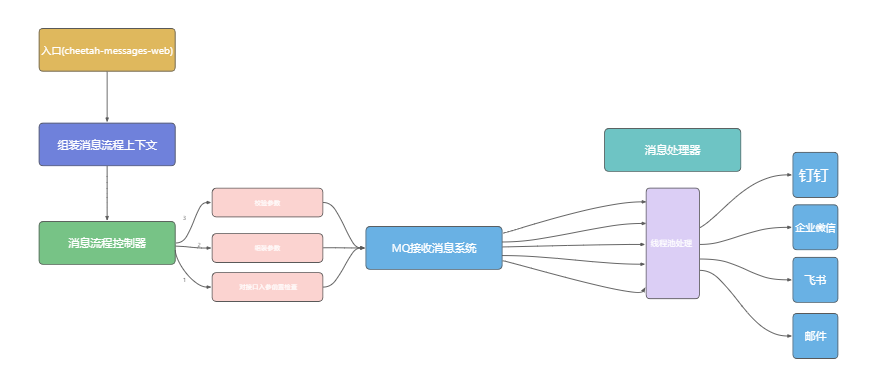
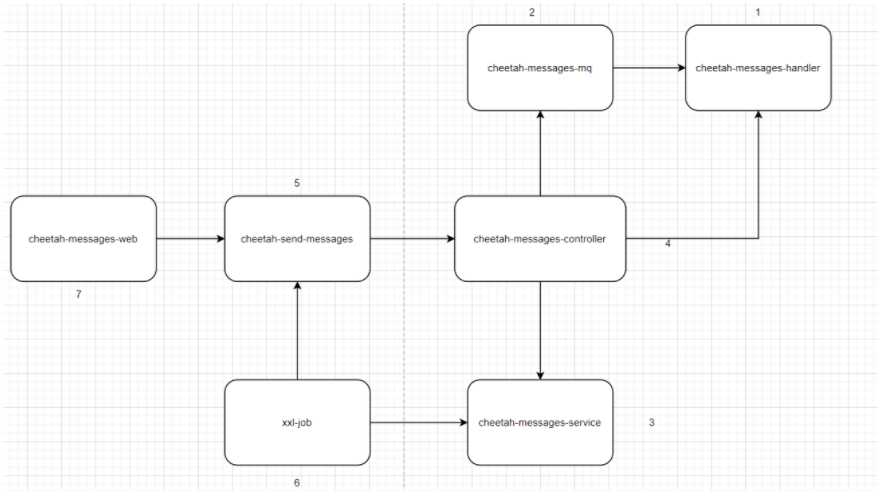

## Star History

# 1. 简介
该项目的名称翻译中文即为猎豹。众所周知，猎豹被冠以速度之快而著名，即因为该特性，我想赋予该项目以快为主要特性，即消息推送低延迟，高响应。该项目是一款消息推送平台，主要是解决用户在发消息时不需要去相应的平台找相应的接口进行消息推送。该项目旨在整合各大平台的消息推送，即当用户在使用该平台时，可以直接在该平台上发送钉钉消息，或者飞书的消息，而不需要去切换平台发送消息。

# 2. 主要构建

项目为微服务，主要服务分为入口(cheetah-messages-web)、组装消息流程上下文、消息流程控制器、MQ接收消息系统、消息处理器。分布式的项目可以搭建在不同的机器上，这样可以让系统的性能提高许多。

## 2.1 项目主要技术栈介绍

- 使用Dubbo进行远程过程调用，并借助nacos作为注册中心。
- 借助nacos进行配置管理，可以实时更改系统相关配置。
- 使用动态线程池处理消息，动态配置线程池核心参数，避免线程池参数设置不合理或者业务环境突发导致线程池参数失效等问题。（dynamic-tp）
- 目前实现rabbitMq作为消息中间件，达到系统解耦，以及提高发送消息速率。
- 对于定时任务发送的业务要求，系统采用了xxl-job框架，为定时任务发送消息的逻辑服务。
# 3. 项目搭建教程

1. git clone 项目
1. 创建相关数据库表，项目sql文件下的三个文件提供了sql语句，可以直接执行。
> cheetah_nacos.sql是nacos内置的的数据库，
> tables_xxl_job.sql是xxl-job内置的数据库，
> 上述两个数据库可以不必从项目中取，都是开源框架提供的，额外一个sql文件是项目内置的，需要执行。

3. 项目由于是微服务搭建的，所以大家在拷下项目后，应该按照先后顺序启动相应服务。
> 项目配置了提供者与服务者在启动时不需要检查是否有提供者，这就避免了每次启动都遵循一定的顺序启动。
> 项目启动顺序：

4. 启动项目以后，在nacos页面查看相关的服务服务列表，如果上述展示了服务列表，即启动成功。
4. 同时打开rabbitMq控制管理中心，查看是否连接成功，以及校验相关交换机队列，绑定路由是否创建成功。
4. 打开cheetah-messages-web找到web控制器，找到相应的接口，进行发送消息即可。
>   
> （钉钉机器人自定义发送消息为例，关于如何实现钉钉机器人发送消息，自行查看钉钉开放文档，此不做赘述）

# 4. 后续进度统计

- 2022-7-29 完成自定义钉钉机器人发送消息。该过程主要逻辑的bug已经处理，无明显bug。

# 5. 展望
项目没有生成可视化界面，这需要一定的前端知识，后续会考虑实现前端，让操作更加简单。
# 6. 参考资料

1. [https://github.com/ZhongFuCheng3y/austin](https://github.com/ZhongFuCheng3y/austin)
